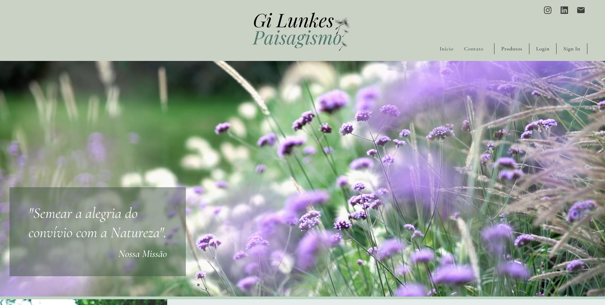
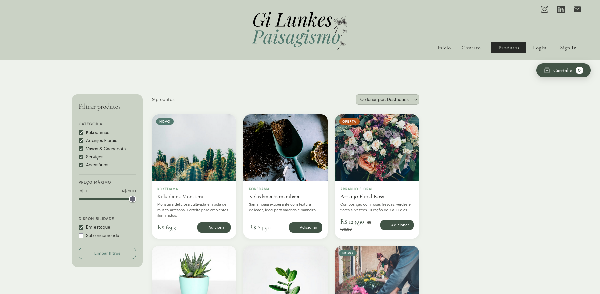

# Gislei Lunkes Paisagismo

Site desenvolvido para a matéria de SCC0219 - Introdução ao Desenvolvimento Web (2026)
Alunos:

- Pedro Lunkes Villela - 15484287
- Fernando Valentim Torres - 15452340
- Artur Kenzo Obara Kawazoe - 15652663

## Cliente

Nossa cliente é a paisagista Gislei Lunkes Villela. Ela faz projetos de paisagismo, principalmente interno, e vende produtos de decoração internos como kokedamas, arranjos de folhas secas e vasos, todos os quais ela mesma produz.

Atualmente seu canal de vendas é exclusivamente por whatsapp, e a maior rede de divulgação é o instagram. Por conta disso, ela não consegue ter escalabilidade nas suas vendas, e se limita a região de Jundiaí.

Pensando nessa dor, foi proposta a opção de montar um site para sua marca, para melhorar a divulgação, e, futuramente, possibilitar mais um canal de vendas. Dessa forma, após uma reunião com a cliente foram levantados os seguintes desejos:

- Responsividade para celular, porque a maioria de seus clientes compra pelo celular
- Landing page com showroom para seus trabalhos
- Seção de quem somos
- Contato para o instagram e integração com o whatsapp business
- Página para vender os seus produtos e serviços online
- Página de controle de estoque
- Página para acompanhar as estatísticas do site (quantos acessos, quantas cliques, quantas compras)

Por fim, nossa cliente providenciou um projeto antigo de site, que foi utilizado como base para esse projeto.

## Projeto

Baseado nos desejos de nossa cliente, implementamos os elementos básicos de front-end para uma primeira validação. Essa primeira entrega contém: uma landing page, com os tipos de proejto realizados (mas sem o portifólio), uma página com produtos, uma página de login e singin.

Todas as páginas contém imagens mockadas e estão sugeitas a mudanças.

Exemplos das páginas prototipadas:

- Página inicial

- Página de produtos

