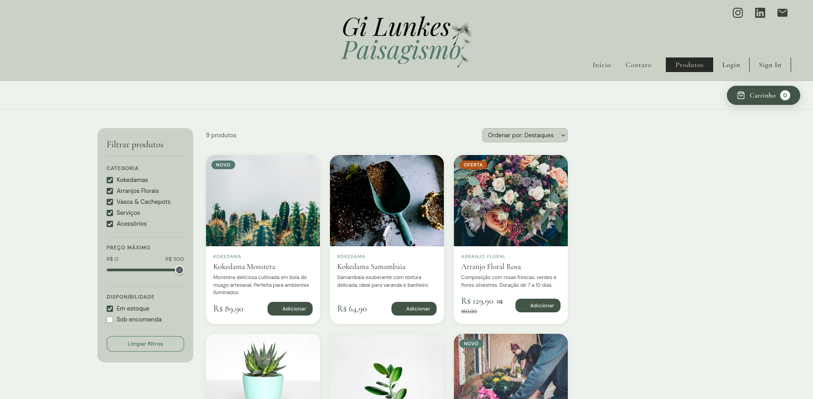

# Gislei Lunkes Paisagismo

Site desenvolvido para a matéria de SCC0219 - Introdução ao Desenvolvimento Web (2026)
Alunos:

- Pedro Lunkes Villela - 15484287
- Fernando Valentim Torres - 15452340
- Artur Kenzo Obara Kawazoe - 15652663

## Cliente

Nossa cliente é a paisagista Gislei Lunkes Villela. Ela faz projetos de paisagismo, principalmente interno, e vende produtos de decoração internos como kokedamas, arranjos de folhas secas e vasos, todos os quais ela mesma produz.

Atualmente seu canal de vendas é exclusivamente por whatsapp, e a maior rede de divulgação é o instagram. Por conta disso, ela não consegue ter escalabilidade nas suas vendas, e se limita a região de Jundiaí.

Pensando nessa dor, foi proposta a opção de montar um site para sua marca, para melhorar a divulgação, e, futuramente, possibilitar mais um canal de vendas. Dessa forma, após uma reunião com a cliente foram levantados os seguintes desejos:

- Responsividade para celular, porque a maioria de seus clientes compra pelo celular
- Landing page com showroom para seus trabalhos
- Seção de quem somos
- Contato para o instagram e integração com o whatsapp business
- Página para vender os seus produtos e serviços online
- Página de controle de estoque
- Página para acompanhar as estatísticas do site (quantos acessos, quantas cliques, quantas compras)

Por fim, nossa cliente providenciou um projeto antigo de site, que foi utilizado como base para esse projeto.

## Projeto

Evoluímos o protótipo de front-end para uma aplicação full-stack: além das páginas
públicas, o projeto agora inclui um backend em Node.js/Express com PostgreSQL, um
backoffice protegido para gestão de produtos/pedidos, autenticação (local + Google),
checkout dinâmico (Infinite Pay ou WhatsApp) e estatísticas de uso anônimas (LGPD).

### Stack

| Camada | Tecnologia |
|--------|-----------|
| Banco | PostgreSQL |
| Backend | Node.js + Express |
| ORM | Sequelize |
| Frontend | HTML5, CSS3, **JavaScript Vanilla** (sem React/Vue/Angular) |
| Autenticação | JWT + Google OAuth 2.0 |
| Pagamento | API Infinite Pay (modo e-commerce) / WhatsApp (modo alternativo) |

### Funcionalidades

- **Landing page** responsiva (mobile-first) com sidebar mobile, Portfólio, Quem
  Somos, Produtos e Serviços, FAQ, Contato (Instagram + WhatsApp) e Footer.
- **Loja** (`produtos.html`): catálogo carregado da API, filtros, carrinho em
  Vanilla JS (persistido em `localStorage`), checkout dinâmico.
- **Modo de venda dinâmico:** um *toggle* no backoffice define se o checkout usa a
  Infinite Pay (online) ou redireciona para o WhatsApp com o resumo do pedido.
- **Backoffice** (`/backoffice`): login de funcionário, CRUD de produtos/estoque,
  gestão de pedidos e configuração do modo de venda.
- **Autenticação:** cadastro/login por e-mail+senha e login com Google.
- **LGPD:** banner de consentimento de cookies, estatísticas 100% anônimas e
  agregadas, e `TERMOS_DE_USO.md`.

## Estrutura de pastas

```
.
├── public/                 # Frontend estático (servido pelo Express)
│   ├── index.html          # Landing page
│   ├── produtos.html       # Loja / carrinho / checkout
│   ├── login.html          # Login de usuário
│   ├── signup.html         # Cadastro de usuário
│   ├── backoffice/         # Painel de funcionários (protegido)
│   ├── css/                # Estilos (paleta verde compartilhada)
│   ├── js/                 # main.js, produtos.js, login.js, signup.js
│   └── imgs/ icons/ videos/
├── src/                    # Backend
│   ├── config/database.js  # Conexão Sequelize
│   ├── models/             # User, Employee, Product, Order, OrderItem, SiteConfig, Analytics
│   ├── controllers/        # Lógica das rotas
│   ├── middlewares/        # auth, errorHandler, rateLimit, analytics
│   ├── routes/             # authUser, public, backoffice
│   ├── services/           # infinitePay.js (integração de pagamento)
│   ├── scripts/            # sync.js (cria tabelas), seed.js (dados iniciais)
│   └── server.js           # App Express (API + estáticos)
├── TERMOS_DE_USO.md        # Política de privacidade (LGPD)
├── .env.example            # Modelo de variáveis de ambiente
└── package.json
```

## Como rodar

### Pré-requisitos

- Node.js 18+ (testado em 26)
- (Opcional, para o backend completo) PostgreSQL 13+

### Instalação

```bash
npm install
```

### Rodando SEM o PostgreSQL (apenas frontend) ✅

Você pode rodar e navegar pelo site **sem banco de dados**. O servidor sobe
normalmente (apenas exibe um aviso de "sem conexão com o banco") e serve todas as
páginas estáticas. O frontend foi feito para degradar com elegância:

```bash
npm install
npm start
# Abra http://localhost:3000
```

**O que funciona sem Postgres:**

- Todas as páginas (landing, loja, login, signup, backoffice/login).
- Catálogo da loja: usa um **catálogo de fallback** embutido (`FALLBACK_PRODUCTS`
  em `public/js/produtos.js`) quando a API não responde.
- Navegação, sidebar mobile, FAQ, carrinho (em `localStorage`), banner de cookies.
- Botão de WhatsApp (usa o número padrão quando a config não está disponível).

**O que NÃO funciona sem Postgres** (depende do banco e retornará erro JSON):

- Cadastro/login real, login do backoffice, CRUD de produtos, criação de pedidos,
  finalização de checkout e estatísticas.

> Dica: para abrir só o frontend sem subir o Node, você também pode abrir os
> arquivos de `public/` diretamente ou com qualquer servidor estático — mas o
> recomendado é `npm start`, pois algumas chamadas usam caminhos `/api` e `/`.

### Rodando COM o PostgreSQL (stack completa)

1. Crie um banco no Postgres (ex.: `gislei_lunkes`).
2. Configure o ambiente:

   ```bash
   cp .env.example .env
   # edite o .env: DB_*, JWT_SECRET, e (opcional) GOOGLE_* / INFINITEPAY_* / WHATSAPP_NUMBER
   ```

3. Crie as tabelas e popule os dados iniciais:

   ```bash
   npm run db:sync     # cria/atualiza todas as tabelas a partir dos models
   npm run db:seed     # cria o admin do backoffice + catálogo inicial
   ```

4. Suba o servihttp://localhost:3000/backoffice/login.htmldor:

   ```bash
   npm start           # ou: npm run dev  (reinício automático)
   ```

5. Acesse:
   - Site: <http://localhost:3000>
   - Backoffice: <http://localhost:3000/backoffice/login.html>
     (use `SEED_ADMIN_EMAIL` / `SEED_ADMIN_PASSWORD` definidos no `.env`)

### Scripts npm

| Comando | Ação |
|---------|------|
| `npm start` | Sobe o servidor |
| `npm run dev` | Sobe com reinício automático (`node --watch`) |
| `npm run db:sync` | Cria/atualiza as tabelas (`-- --force` recria do zero, **apaga tudo**) |
| `npm run db:seed` | Insere admin + produtos iniciais |

### Rodando com Docker

A forma mais simples de subir tudo (banco + app + GUI do banco):

```bash
docker compose up --build
```

Serviços:

- **db** — PostgreSQL.
- **app** — backend + frontend + backoffice (integrados; o `app` roda `db:sync`
  e `db:seed` automaticamente antes de subir). Site em <http://localhost:3000>,
  backoffice em `/backoffice/login.html`.
- **adminer** — GUI web do banco em <http://localhost:8080>.

Variáveis (com defaults sensatos) podem ser sobrescritas via `.env` na raiz —
ex.: `JWT_SECRET`, `SEED_ADMIN_*`, `GOOGLE_CLIENT_ID`, `INFINITEPAY_*`. Sem
chaves da Infinite Pay, o checkout PIX roda em **modo demonstração** (QR/código
PIX simulados).

## Documentação da API (Swagger)

A documentação interativa de todas as rotas REST fica em:

- **Swagger UI:** <http://localhost:3000/api/docs>
- **OpenAPI JSON:** <http://localhost:3000/api/docs.json>

## Banco de dados — tabelas

As tabelas são criadas automaticamente por `npm run db:sync` (a partir dos models
em `src/models/`). São **7 tabelas**:

| Tabela | Model | Descrição | Campos principais |
|--------|-------|-----------|-------------------|
| `users` | `User` | Clientes finais (local + Google) | `id` (UUID), `name`, `email` (único), `password_hash`, `google_id`, `provider`, `avatar_url` |
| `employees` | `Employee` | Funcionários do backoffice | `id` (UUID), `name`, `email` (único), `password_hash`, `role` (`admin`/`funcionario`), `active` |
| `products` | `Product` | Catálogo (kokedamas, arranjos, vasos, serviços, acessórios) | `id` (UUID), `name`, `description`, `category`, `badge`, `price`, `old_price`, `image_url`, `quantity`, `stock_status`, `active` |
| `orders` | `Order` | Pedidos realizados | `id` (UUID), `user_id`, `customer_name`, `customer_email`, `customer_phone`, `total`, `payment_method` (`infinitepay`/`whatsapp`), `status`, `payment_ref`, `notes` |
| `order_items` | `OrderItem` | Itens de cada pedido (snapshot de nome/preço) | `id` (UUID), `order_id`, `product_id`, `product_name`, `unit_price`, `quantity` |
| `site_config` | `SiteConfig` | Configuração global (linha única) | `id` (=1), `ecommerce_active`, `whatsapp_number`, `store_name` |
| `analytics` | `Analytics` | Estatísticas anônimas agregadas (LGPD) | `id` (UUID), `day`, `event_type`, `path`, `ref_id`, `count` |

**Relacionamentos:**

- `users` 1—N `orders` (pedido de convidado tem `user_id` nulo)
- `orders` 1—N `order_items` (cascade ao excluir o pedido)
- `products` 1—N `order_items` (`product_id` nulo se o produto for removido depois)

> Colunas em `snake_case` (Sequelize `underscored`). Timestamps `created_at` /
> `updated_at` presentes em todas as tabelas.

## Conformidade (LGPD)

As estatísticas de uso (`analytics`) são **100% anônimas e agregadas**: não
armazenam IP, user-agent, identificador de usuário nem cookies de rastreamento —
apenas contadores por dia/evento/caminho. Detalhes e direitos do titular em
[`TERMOS_DE_USO.md`](TERMOS_DE_USO.md).

## Variáveis de ambiente

Veja [`.env.example`](.env.example) para a lista completa. Resumo:

- **Servidor:** `PORT`, `APP_URL`, `NODE_ENV`
- **Banco:** `DB_HOST`, `DB_PORT`, `DB_NAME`, `DB_USER`, `DB_PASSWORD` (ou `DATABASE_URL`), `DB_SSL`
- **Auth:** `JWT_SECRET`, `JWT_EXPIRES_IN`, `GOOGLE_CLIENT_ID`, `GOOGLE_CLIENT_SECRET`
- **Pagamento:** `INFINITEPAY_API_KEY`, `INFINITEPAY_HANDLE`, `INFINITEPAY_API_URL`
- **WhatsApp:** `WHATSAPP_NUMBER`
- **Seed:** `SEED_ADMIN_EMAIL`, `SEED_ADMIN_PASSWORD`, `SEED_ADMIN_NAME`

## Capturas de tela

- Página inicial


- Página de produtos

